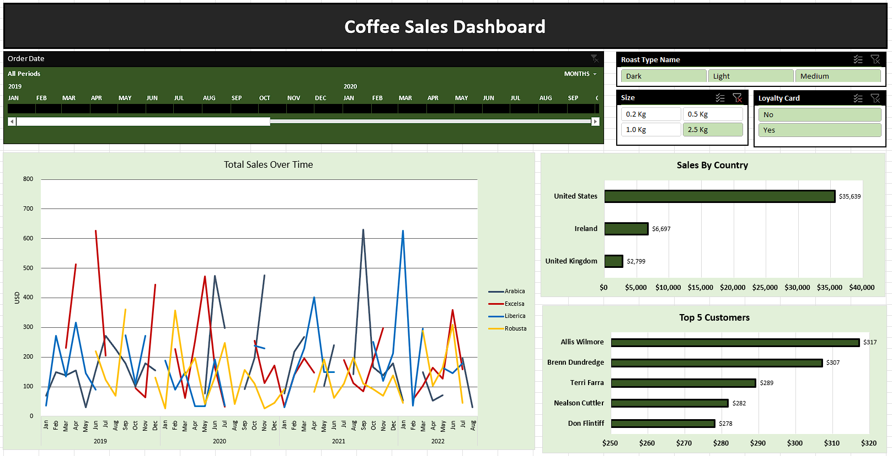

# **Coffee Sales Data Analysis**

## Project Overview

This project involves analyzing coffee sales data using Microsoft Excel to uncover insights, trends, and actionable recommendations. The dataset includes key information on sales performance, product categories, and customer preferences. The project culminates in an interactive dashboard that visualizes critical insights.

## Project Preview

## Key Features

- **Data Cleaning & Preparation:** Managed missing values, standardized data formats, and ensured data consistency.

- **Exploratory Data Analysis (EDA):** Analyzed sales trends, product performance, and customer behavior.

- **Dashboard Creation:** Developed an interactive dashboard to visualize:

  - Monthly and yearly sales trends

  - Top-performing products and categories

  - Regional sales insights

  - Key performance metrics such as revenue, profit, and customer retention

- **Actionable Insights:** Provided strategic recommendations based on data-driven observations.

## Tools Used

- Microsoft Excel

  - Pivot Tables

  - Conditional Formatting

  - XLookups & Index Match

- Visuals include bar charts, line charts, and KPI metrics for effective storytelling.

## How to Use

1. Download the project files from this repository.

2. Open the Excel file for raw data (Coffee Sales Data.xlsx).

3. Open the Excel dashboard file for final project (Coffee Final Dashboard.xlsx).

4. Interact with the visual elements and filters to explore insights.

## Insights & Recommendations

- Focus marketing efforts on top-performing products to boost sales.

- Optimize inventory for regions with higher demand to improve efficiency.

- Identify seasonal trends to plan promotions and campaigns effectively.

## Future Enhancements

- Integrate Power BI for advanced visualizations.

- Automate data updates for real-time insights.

## Contact

For questions or collaboration, feel free to reach out via [LinkedIn](https://www.linkedin.com/in/vedantshinde25).

