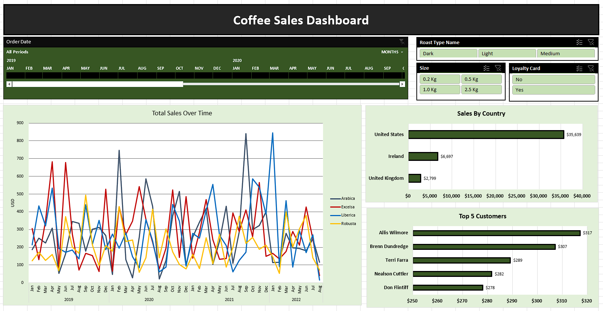

# Coffee Sales Data Analysis

## Overview

This project delivers a full-cycle analysis of coffee sales data using **Microsoft Excel**, uncovering trends, patterns, and actionable business insights. It concludes with an **interactive Excel dashboard** designed to support data-driven decision-making across departments.

---
> *Visual tools used: PivotTables, slicers, bar/line charts, conditional formatting*

---

## Objectives

- Analyze sales performance across time, products, and regions  
- Uncover customer purchasing trends and product preferences  
- Provide actionable recommendations to improve marketing, sales, and operations  
- Present insights through a clean, interactive Excel dashboard  

---

## Business Value Delivered

| Area            | Value Provided                                                                 |
|-----------------|---------------------------------------------------------------------------------|
| **Sales**       | Highlighted best-selling products and top-performing regions                   |
| **Marketing**   | Identified seasonal trends to align campaigns with customer behavior           |
| **Operations**  | Supported inventory planning with regional demand insights                     |
| **Strategy**    | Delivered performance metrics to guide growth and product focus                |

---

## Key Highlights

### Data Preparation
- Cleaned and standardized dataset for consistency  
- Addressed missing values and formatting issues  
- Prepared data for accurate and efficient analysis  

### Exploratory Data Analysis (EDA)
- Assessed monthly and yearly sales performance  
- Analyzed product category effectiveness  
- Evaluated customer purchasing behavior and retention  

### Dashboard Features

**Includes visual breakdowns of:**
- Time-series sales trends (monthly & yearly)  
- Top-performing products and categories  
- Regional sales comparisons  
- Key performance indicators (KPIs) including revenue, profit, and retention  

---

## Actionable Insights

- **Boost high-performing SKUs:** Prioritize marketing efforts where ROI is proven  
- **Align stock with demand:** Reduce waste and delays by optimizing by region  
- **Leverage seasonality:** Capitalize on peak sales months through timely promotions  

---

## Cross-Industry Applications

| Industry        | How This Analysis Can Be Applied                                                   |
|-----------------|-------------------------------------------------------------------------------------|
| **Retail**      | Optimize product placement and region-specific assortments                         |
| **E-Commerce**  | Personalize product recommendations based on customer behavior                     |
| **Hospitality** | Improve purchasing strategy based on sales trends of food/beverage items           |
| **Supply Chain**| Enhance forecasting and reduce overstock/understock scenarios                      |
| **Consumer Goods** | Guide product development and strategic regional launches                      |

---

## Tools & Techniques Used

| Tool              | Key Features Utilized                                      |
|-------------------|------------------------------------------------------------|
| **Microsoft Excel** | PivotTables, INDEX-MATCH, XLOOKUP, Conditional Formatting |
| **Visual Elements** | Bar charts, Line charts, Slicers, KPI Cards               |

---

## Contact

For inquiries, feedback, or collaboration opportunities:  
**LinkedIn:** [Vedant Shinde](https://www.linkedin.com/in/vedantshinde25)
